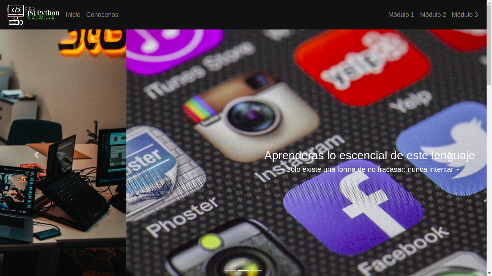

# JSJ Python
This project was made with the object to teach Python language programming to school students, the project was located in Usme a Bogota's localidad. We used
Python, Flask, heroku and firebase.
 
[Project's link on Heroku](https://jsjpython.herokuapp.com/ "Project's link on Heroku")

